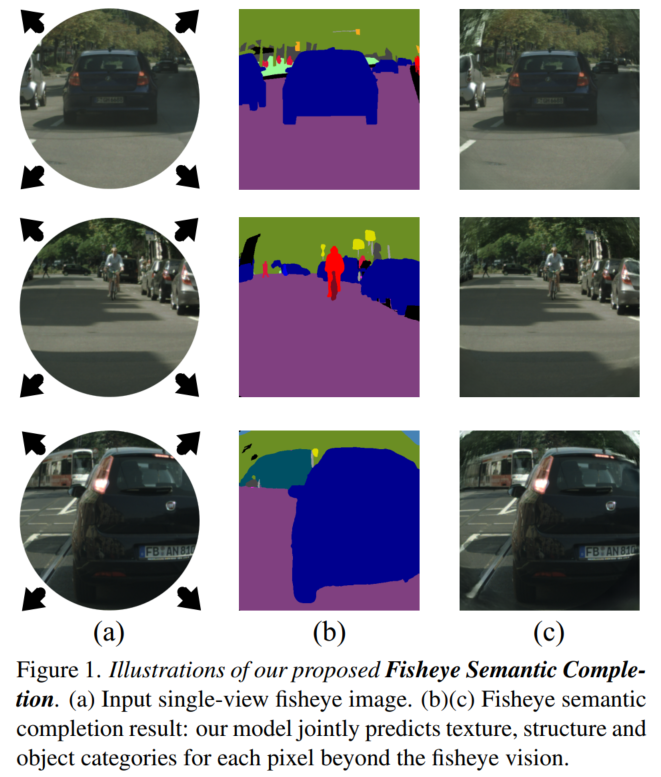
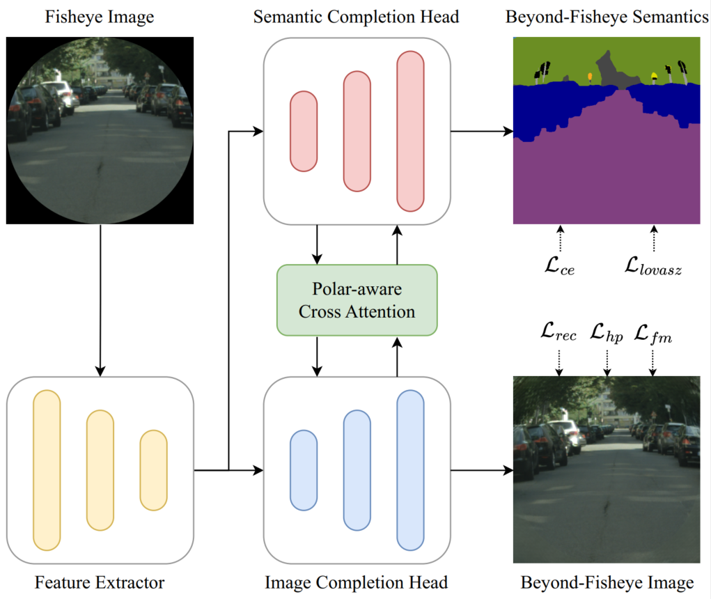
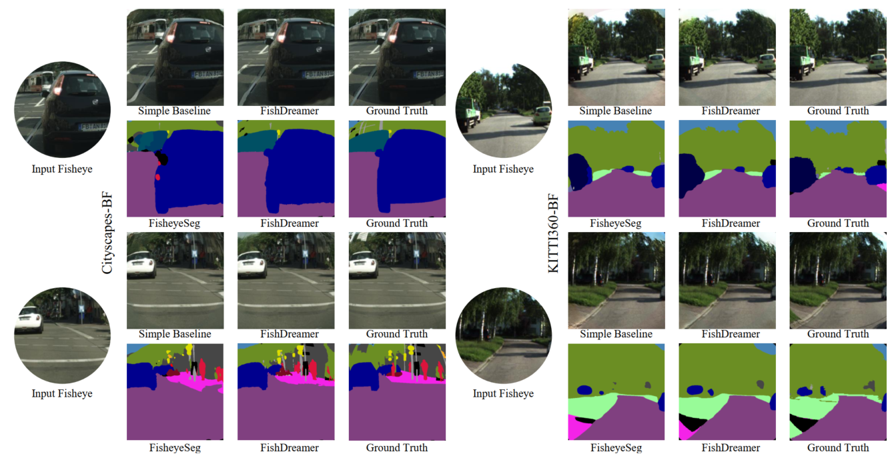

### <p align="center">FishDreamer: Towards Fisheye Semantic Completion via Unified Image Outpainting and Segmentation
<br>
<div align="center">
  <a href="https://www.researchgate.net/profile/Shi-Hao-10" target="_blank">Hao&nbsp;Shi</a> <b>&middot;</b>
  Yu&nbsp;Li</a> <b>&middot;</b> &emsp;
  <a href="https://www.researchgate.net/profile/Kailun-Yang" target="_blank">Kailun&nbsp;Yang</a> <b>&middot;</b> &emsp;
  <a href="https://www.researchgate.net/profile/Jiaming-Zhang-10" target="_blank">Jiaming&nbsp;Zhang</a> <b>&middot;</b> &emsp;
  <a href="https://www.researchgate.net/profile/Kunyu-Peng" target="_blank">Kunyu&nbsp;Peng</a> <b>&middot;</b>
  <a href="https://www.researchgate.net/profile/Alina-Roitberg-2" target="_blank">Alina&nbsp;Roitberg</a> <b>&middot;</b>
  <a href="https://www.researchgate.net/profile/Yaozu-Ye" target="_blank">Yaozu&nbsp;Ye</a> <b>&middot;</b>
  Huajian&nbsp;Ni</a> <b>&middot;</b>
  <a href="https://www.researchgate.net/profile/Kaiwei-Wang-4" target="_blank">Kaiwei&nbsp;Wang</a> <b>&middot;</b>
  <a href="https://www.researchgate.net/profile/Rainer-Stiefelhagen" target="_blank">Rainer&nbsp;Stiefelhagen</a>
  <br> <br>

[comment]: <> (  <a href="https://arxiv.org/pdf/2211.11293.pdf" target="_blank">Paper</a>)

####

[comment]: <> (<a href="https://arxiv.org/" target="_blank">Paper</a> &emsp;)

[comment]: <> (  <a href="https://arxiv.org/" target="_blank">Demo Video &#40;Youtube&#41;</a> &emsp;)

[comment]: <> (  <a href="https://arxiv.org/" target="_blank">演示视频 &#40;B站&#41;</a> &emsp;)
</div>
<br>
<p align="center">:hammer_and_wrench: :construction_worker: :rocket:</p>
<p align="center">:fire: We will release code and checkpoints in the future. :fire:</p>
<br>

<div align=center></div>

[comment]: <> (### Update)

[comment]: <> (- 2022.11.21 Release the [arXiv]&#40;https://arxiv.org/abs/2211.11293&#41; version with supplementary materials.)

### TODO List
- [ ] Code release. 
- [ ] CityScape-BF & KITTI360-BF release. (Generative code maybe.)

### Abstract
This paper raises the new task of Fisheye Semantic Completion (FSC), where dense texture, structure, and semantics of a fisheye image are inferred even beyond the sensor field-of-view (FoV).
Fisheye cameras have larger FoV than ordinary pinhole cameras, yet its unique special imaging model naturally leads to a blind area at the edge of the image plane.
This is suboptimal for safety-critical applications since   important perception tasks, such as semantic segmentation, become very challenging within the blind zone.
Previous works  considered the out-FoV outpainting  and in-FoV segmentation separately. 
However, we observe that these two tasks are actually closely coupled. 
To jointly estimate the tightly intertwined complete fisheye image and scene semantics, we introduce the new FishDreamer which relies on successful ViTs enhanced with a novel Polar-aware Cross Attention module (PCA)  to leverage dense context and guide semantically-consistent content generation while considering different polar distributions.
In addition to the contribution of the novel task and architecture, we also derive Cityscapes-BF and KITTI360-BF datasets to facilitate training and evaluation of this new track. Our experiments demonstrate that the proposed FishDreamer outperforms methods solving each task in isolation and surpasses alternative approaches on the Fisheye Semantic Completion. 

## Method

<p align="center">
    (Overview)
</p>
<p align="center">
    <div align=center></div>
<br><br>

## Results
<div align=center></div>

[comment]: <> (### Citation)

[comment]: <> (   If you find our paper or repo useful, please consider citing our paper:)

[comment]: <> (   ```bibtex)

[comment]: <> (   @article{shi2022flowlens,)

[comment]: <> (  title={FlowLens: Seeing Beyond the FoV via Flow-guided Clip-Recurrent Transformer},)

[comment]: <> (  author={Shi, Hao and Jiang, Qi and Yang, Kailun and Yin, Xiaoting and Wang, Kaiwei},)

[comment]: <> (  journal={arXiv preprint arXiv:2211.11293},)

[comment]: <> (  year={2022})

[comment]: <> (})

[comment]: <> (   ```)

### Contact
Feel free to contact me if you have additional questions or have interests in collaboration. Please drop me an email at haoshi@zju.edu.cn. =)
